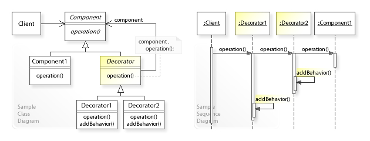

# Decorator Pattern

Attach *additioinal responsibilities to an object dynamically*. Decorators provide a flexible alternative to subclassing for extending functionality.

## Problem

* Responsibilities should be added to (and removed from) an object dynamically at run-time.
* A flexible alternative to subclassing for extending functionality should be provided.

## Solution

Define `Decorator` objects that
* implement the interface of the extended (decorated) object (`Component`) transparently by forwarding all requests to it and 
* perform additional functionality before/after forwarding a request.

## Common Structure



* Component (Cake)
  * defines the interface for objects that can have responsibilities added to them dynamically.
* ConcreteComponent (MuffinCake)
  * defines an object to which additional responsibilities can be attached.
* Decorator (CakeDecorator)
  * maintains a reference to a Component object and defines an interface that conforms to Component's interface.
* ConcreteDecorator (WhippedCream)
  * adds responsibilities to the component.

## Collaboration

Decorator forwards requests to its Component object. It may optionally perform additional operations before and after forwarding the request.

## Benefits

* provide a flexible alternative to subclassing for extending functionality.
* allow behavior modification of an object dynamically at run-time.

## Drawbacks

* can result in many small objects and overuse can be complex.
* can cause issues if the client relies heavily on the components concrete type.
* A decorator and its component aren't identical.
  * A decorator acts a transparant enclosure. From an object identity point of view, a decorated component is not identical to the component itself. Hence you shouldn't rely on object identity when you use decorators.

## Example

See complete [Cake Factory](https://gitlab.com/tk-bachelor/se1-testat3-decorator) with Decorator Pattern in Java

**Definition**


Component
```java
public abstract class Cake {
	protected String description = "cake";
	private LocalDate createdDate;

	public Cake() {
		this.createdDate = LocalDate.now();
	}

	public String getDescription() {
		return description;
	}

	public final double cost() {
		LocalDate twoDaysAgo = LocalDate.now().minus(2, ChronoUnit.DAYS);

		double baseCost = baseCost();
		return createdDate.isBefore(twoDaysAgo) ? baseCost * 0.8 : baseCost;
	}

	public void setCreatedDate(LocalDate createdDate) {
		this.createdDate = createdDate;
	}

	protected abstract double baseCost();
}
```

ConcreteComponent
```java
public class MuffinCake extends Cake {

	protected String description = "6-set bilberry muffin";

	@Override
	public String getDescription() {
		return String.format("%s %s", this.description, super.getDescription());
	}

	@Override
	public double baseCost() {
		return 19;
	}

}
```

Decorator
```java
public abstract class CakeDecorator extends Cake {
	protected Cake innerCake;
	protected String description;
	protected double cost;

	public CakeDecorator(Cake cake, String description, double cost) {
		this.innerCake = cake;
		this.description = description;
		this.cost = cost;
	}

	@Override
	public String getDescription() {
		return String.format("%s, %s", innerCake.getDescription(), this.description);
	}

	@Override
	public double baseCost() {
		return this.cost + innerCake.baseCost();
	}

	protected <T> boolean isInnerCake(Class<T> type) {
		Cake cake = innerCake;
		System.out.println(cake.getClass());
		do {
			if (cake instanceof CakeDecorator) {
				cake = ((CakeDecorator) cake).innerCake;
			} else if (cake.getClass().equals(type)) {
				return true;
			} else {
				return false;
			}
		} while (cake != null);
		return false;
	}
}
```

ConcreteDecorator
```java
public class WhippedCream extends CakeDecorator {

	public WhippedCream(Cake cake) {
		super(cake, "Whipped Cream", 4.5);
	}

}
```

**Usage**
```java
Cake cake = new MuffinCake(); // 19
cake = new WhippedCream(cake); // 4.50
cake = new ChocolateSprinkles(cake); // 2.50
cake = new TextWriting(cake, "Anniversary"); // 8

assertEquals("muffin cake description",
        "6-set bilberry muffin cake, Whipped Cream, Chocolate Sprinkles, Anniversary with ink on a card",
        cake.getDescription());
assertEquals(cake.getDescription(), 34, cake.cost(), 0);
```

## Relations with Other Patterns

* **Adapter**: A decorator is different from an adapter in that a decorator only changes an object's responsibilities, not its interface; an adapter will give an object a completely new interface.
* **Composite**: A decorator can be viewed as a degenerate composite with **only one component**. However, a decorator adds additional responsibilities - it isn't intended for object aggregation.
* **Strategy**: A decorator lets you change the skin of an object; a strategy lets you change the guts. These are two alternative ways of changing an object.
